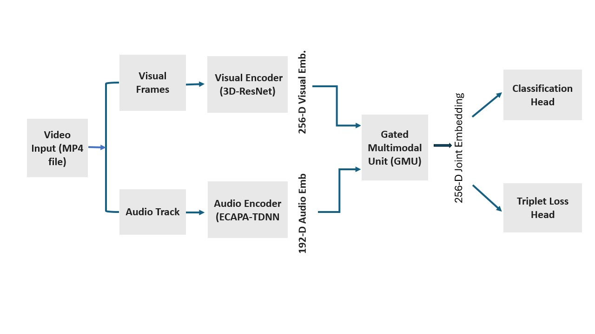

# Multimodal Biometric Authentication Using Lip Motion and Spoken Passphrases  
### BIOVID Challenge 2025 – Dual-Factor Audio–Visual Authentication  

**Authors:**  
- **Venu Siddapura Govindaraju** – University of Naples Federico II, DIETI  
- **Stefano Marrone** – University of Naples Federico II, DIETI  
- **Carlo Sansone** – University of Naples Federico II, DIETI  

This repository contains the official implementation of our method submitted to the **BIOVID Challenge 2025**, titled:

> **“Multimodal Biometric Authentication Using Lip Motion and Spoken Passphrases.”**  
> Accepted in *ICIAP 2025 Workshop – BIOVID Challenge (LNCS Volume)*

Our system performs **open-set biometric authentication** using synchronized audio–visual MP4 videos. Each sample includes:

- **Lip-motion RGB frames**  
- **Spoken passphrase audio**

We use a **dual-stream architecture**:  
3D-ResNet18 + BiGRU for visual encoding, and ECAPA-TDNN for audio encoding.  
A **Gated Multimodal Unit (GMU)** fuses both streams into a 256-D embedding used for classification and identity verification.

---

## 🔥 Key Contributions

- **Dual-stream audio–visual architecture**
- **GMU-based adaptive fusion**
- **Hybrid Triplet + BCE loss**
- **Open-set decision using cosine similarity + threshold**
- **Full pipeline: preprocessing → training → inference → submission**

---

## 🧠 System Architecture

The overall architecture of the proposed dual-stream audio–visual authentication system is shown below:




## Dataset
The BIOVID dataset is restricted and cannot be shared publicly.

To access it:

- **Register for the BIOVID Challenge 2025

- **Submit your method description

- **Receive download approval from the organizers

---
## 📂 Project Structure

```text
Biovid-Challenge2025/
├── data/                     # EXCLUDED – BIOVID dataset not included
├── datasets/
│   └── biovid_dataset.py     # Data loader + preprocessing
├── models/
│   ├── audio_encoder.py      # ECAPA-TDNN
│   ├── visual_encoder.py     # 3D-ResNet18 + BiGRU
│   ├── gmu_fusion.py         # Gated Multimodal Unit
│   ├── fusion_head.py
│   └── output_head.py
├── samplers/
│   └── triplet_sampler.py    # Semi-hard triplet mining
├── scripts/
│   ├── preprocessing/
│   │   └── preprocess.py     # Frame extraction & audio extraction
│   ├── inference/
│   └── utils/
├── notebooks/
│   ├── updated_pipeline.ipynb
│   └── 02_model_visual.ipynb
├── results/
│   ├── fold0_best_model.pt
│   ├── fold1_best_model.pt
│   ├── fold2_best_model.pt
│   └── gmu_fusion/
│       └── fold0_best_model.pt
├── submission/
│   └── submission.json
├── train_crossval.py
├── test_inference_vote.py
├── evaluate_eer.py
├── requirements.txt
└── README.md

